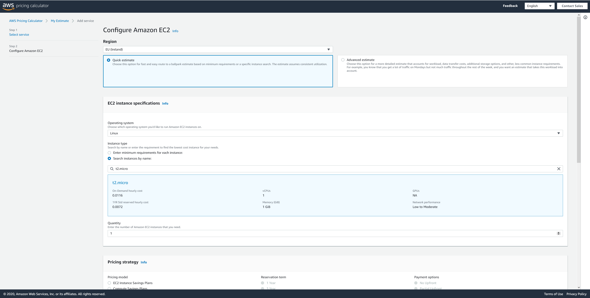
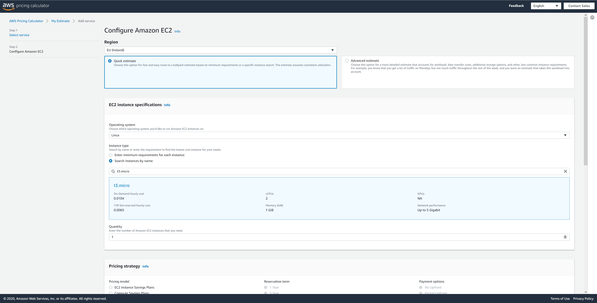
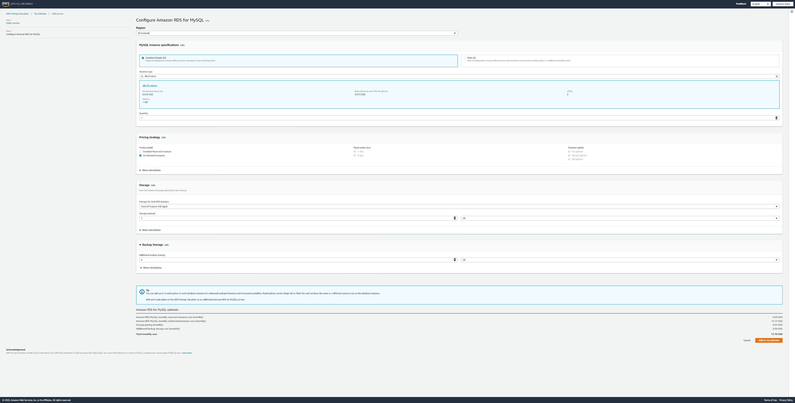

# elasticbeanstalk-showroom
Template to create a Symfony website on AWS Elasticbeanstalk

# Prerequisites
1. Create an AWS account : https://aws.amazon.com/fr/console/ (french link, but you will be redirected on the correct locale)
2. 

# What will be created
TODO

# Architecture
## Description
* Configuration presets: Single instance (Free Tier eligible)
* EC2 instance type: t2.micro
* Platform: PHP 7.4 running on 64bit Amazon Linux 2/3.0.3

## Logical schema

# Billing
> Prices are calculated for "Frankurt" region (eu-central-1) on 27 june 2020. Change with time and different region.

We use AWS Pricing generator to complete this section : https://calculator.aws/#/createCalculator

## EC2 instance
AWS release new iteration of t(x) instances. Latest version is now t3. Let's compare t2.micro and t3.micro

| Instance size | CPU | Memory | Price per month (on demand) |
|---------------|-----|--------|-----------------------------|
| t2.micro      | 1   | 1      | 8.47 USD                    |
| t3.micro      | 2   | 1      | 7.59 USD                    |

Amazon Elastic Block Storage (EBS) pricing does not include storage costs because Elastic Beanstalk applications run on Amazon EC2 instances that have no persistent local storage (instance store backed instances).

We will use t3.micro as this new type has more more compute and cost less than the previous generation.

### t2.micro pricing review

### t3.micro pricing review

## RDS
| Instance size    | CPU | Memory | Price per month (on demand) |
|------------------|-----|--------|-----------------------------|
| db.t3.micro      | 2   | 1      | 13.14 USD                   |

As we will provision database with 5 Gb of storage, this will add 0.64 USD per month on the billing. We assume no backup storage as this a demo of Elastic Beanstalk.

## S3
To be estimated later (less than 1 USD per month).

## Total cost
|       | Service | Cost per month |
|-------|---------|----------------|
|       | EC2     | 7.59 USD       |
|       | RDS     | 13,14 USD      |
| Total |         | 20.73 USD      |

## How to control costs
TODO: how to create budget on AWS.

# Links
AWS Elastic Beanstalk release notes : https://docs.aws.amazon.com/elasticbeanstalk/latest/relnotes/welcome.html
Deploying a Symfony application to Elastic Beanstalk : https://docs.aws.amazon.com/elasticbeanstalk/latest/dg/php-symfony-tutorial.html (Outdated Symfony version /!\)