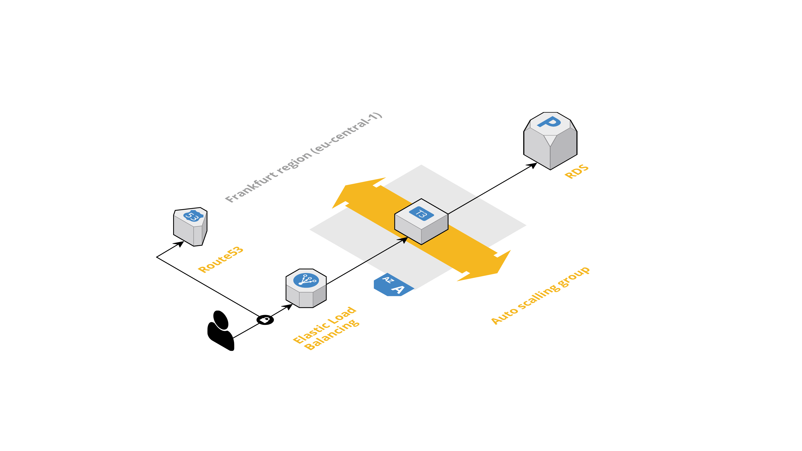
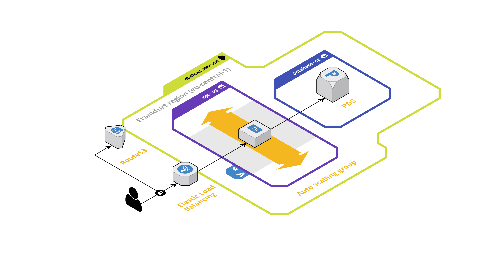

# Elasticbealk showroom

This repository is a template of ressources that allow you to create a Symfony website on AWS Elasticbeanstalk.


[](https://github.com/pre-commit/pre-commit)

## Table of contents

1. [Architecture overview](#architecture)
2. [Cost estimation](#cost-estimation)
3. [Manage billing drift](#billing-drift)
4. [Installation](#installation)
5. [Roadmap](#roadmap)
6. [Links](#links)

<a name="architecture"></a>

## Architecture overview

### Network design

Network CIDR : `172.31.0.0/16`

* Public subnets (Used for NAT purpose) :
  * `172.31.1.0/24`
  * `172.31.2.0/24`
* Private subnets :
  * `172.31.3.0/24`
  * `172.31.4.0/24`  

### Logical diagram



### Network oriented diagram



<a name="cost-estimation"></a>

## Cost estimation 
> :warning: Prices are calculated for "Frankurt" region (eu-central-1) on 27 june 2020. Values may change with time and different region.
> This showroom is designed to fit as possible in AWS Free Tier. Cost should be lower than expected on the below section.

We use AWS Pricing generator to complete this section : <https://calculator.aws/#/createCalculator>

### EC2 instance

AWS release new iteration of t(x) instances. Latest version is now t3. Let's compare t2.micro and t3.micro

| Instance size | CPU | Memory | Price per month (on demand) |
|---------------|-----|--------|-----------------------------|
| t2.micro      | 1   | 1      | 8.47 USD                    |
| t3.micro      | 2   | 1      | 7.59 USD                    |

Amazon Elastic Block Storage (EBS) pricing does not include storage costs because Elastic Beanstalk applications run on Amazon EC2 instances that have no persistent local storage (instance store backed instances).

We will use t3.micro as this new type has more more compute and cost less than the previous generation.

#### t2.micro pricing review


#### t3.micro pricing review


### RDS

| Instance size    | CPU | Memory | Price per month (on demand) |
|------------------|-----|--------|-----------------------------|
| db.t3.micro      | 2   | 1      | 13.14 USD                   |

As we will provision database with 5 Gb of storage, this will add 0.64 USD per month on the billing. We assume no backup storage as this is a demo of Elastic Beanstalk.


### Networking

TODO: NAT gateway

### S3

To be estimated later (less than 1 USD per month).

### Total cost

|       | Service | Cost per month |
|-------|---------|----------------|
|       | EC2     | 7.59 USD       |
|       | RDS     | 13,14 USD      |
| Total |         | 20.73 USD      |

<a name="billing-drift"></a>

## Manage billing drift

As infrastructures can change over time, it is very important to manage billing drift and by predictable on how many it costs.

I use <https://github.com/aliscott/infracost> to get cost hourly and monthly estimates for a Terraform project.
Please install it with <https://github.com/aliscott/infracost#installation>

Thanks to Github actions, this tool can be used to automatically add a PR comment showing the cost estimate diff between a pull request and the master branch whenever a .tf file changes.

<a name="installation"></a>

## Installation

### Prerequisites

#### AWS

1. Create an AWS account : <https://aws.amazon.com/fr/console/> (french link, but you will be redirected on the correct locale)
2. Create IAM user with correct rights :

```json
{
    "Version": "2012-10-17",
    "Statement": [
        {
            "Effect": "Allow",
            "Action": [
                "elasticbeanstalk:*",
                "ec2:*",
                "s3:*",
                "ecs:*",
                "ecr:*",
                "elasticloadbalancing:*",
                "autoscaling:*",
                "cloudwatch:*",
                "s3:*",
                "sns:*",
                "cloudformation:*",
                "dynamodb:*",
                "rds:*",
                "sqs:*",
                "logs:*",
                "iam:GetPolicyVersion",
                "iam:GetRole",
                "iam:PassRole",
                "iam:ListRolePolicies",
                "iam:ListAttachedRolePolicies",
                "iam:ListInstanceProfiles",
                "iam:ListRoles",
                "iam:ListServerCertificates",
                "iam:CreateServiceLinkedRole",
                "acm:DescribeCertificate",
                "acm:ListCertificates",
                "codebuild:CreateProject",
                "codebuild:DeleteProject",
                "codebuild:BatchGetBuilds",
                "codebuild:StartBuild",
                "sts:AssumeRole"
            ],
            "Resource": "*"
        },
        {
            "Effect": "Allow",
            "Action": [
                "iam:AddRoleToInstanceProfile",
                "iam:CreateInstanceProfile",
                "iam:CreateRole"
            ],
            "Resource": [
                "arn:aws:iam::*:role/aws-elasticbeanstalk*",
                "arn:aws:iam::*:instance-profile/aws-elasticbeanstalk*"
            ]
        },
        {
            "Effect": "Allow",
            "Action": [
                "iam:CreateServiceLinkedRole"
            ],
            "Resource": [
                "arn:aws:iam::*:role/aws-service-role/autoscaling.amazonaws.com/AWSServiceRoleForAutoScaling*"
            ],
            "Condition": {
                "StringLike": {
                    "iam:AWSServiceName": "autoscaling.amazonaws.com"
                }
            }
        },
        {
            "Effect": "Allow",
            "Action": [
                "iam:CreateServiceLinkedRole"
            ],
            "Resource": [
                "arn:aws:iam::*:role/aws-service-role/elasticbeanstalk.amazonaws.com/AWSServiceRoleForElasticBeanstalk*"
            ],
            "Condition": {
                "StringLike": {
                    "iam:AWSServiceName": "elasticbeanstalk.amazonaws.com"
                }
            }
        },
        {
            "Effect": "Allow",
            "Action": [
                "iam:CreateServiceLinkedRole"
            ],
            "Resource": [
                "arn:aws:iam::*:role/aws-service-role/elasticloadbalancing.amazonaws.com/AWSServiceRoleForElasticLoadBalancing*"
            ],
            "Condition": {
                "StringLike": {
                    "iam:AWSServiceName": "elasticloadbalancing.amazonaws.com"
                }
            }
        },
        {
            "Effect": "Allow",
            "Action": [
                "iam:AttachRolePolicy"
            ],
            "Resource": "arn:aws:iam::*:role/aws-elasticbeanstalk*",
            "Condition": {
                "StringLike": {
                    "iam:PolicyArn": [
                        "arn:aws:iam::aws:policy/AWSElasticBeanstalk*",
                        "arn:aws:iam::aws:policy/service-role/AWSElasticBeanstalk*"
                    ]
                }
            }
        }
    ]
}
```

3. check "Programmatic access" and get access and secret keys.
4. Install AWS CLI on your computer
5. Add a profile called `elasticbeanstalk-showroom` and fill credentials.

#### Development

Please install :

* `precommit` : <https://pre-commit.com/>
* *`terraform-docs` : <https://github.com/terraform-docs/terraform-docs>
* `tflint` : <https://github.com/terraform-linters/tflint>
* `checkov` : <https://github.com/bridgecrewio/checkov>
* `coreutils` (MacOS only) : <https://formulae.brew.sh/formula/coreutils>

And run `pre-commit install`.

### It's show time

1. `make init`
2. `make apply`

<a name="roadmap"></a>

## Roadmap

* Add CI/CD part this codeCommit, codeBuild, codePipeline 
* Add Symfony template

<a name="links"></a>

## Links

* AWS Elastic Beanstalk release notes : <https://docs.aws.amazon.com/elasticbeanstalk/latest/relnotes/welcome.html>
* Deploying a Symfony application to Elastic Beanstalk : <https://docs.aws.amazon.com/elasticbeanstalk/latest/dg/php-symfony-tutorial.html> ( :warning: Outdated Symfony version)
* AWS Pricing Calculator : <https://calculator.aws/#/createCalculator>
* AWS named profiles : <https://docs.aws.amazon.com/cli/latest/userguide/cli-configure-profiles.html>

## Thanks

Tomas Fagerbekk (https://gist.github.com/tomfa) : <https://gist.github.com/tomfa/6fc429af5d598a85e723b3f56f681237>
